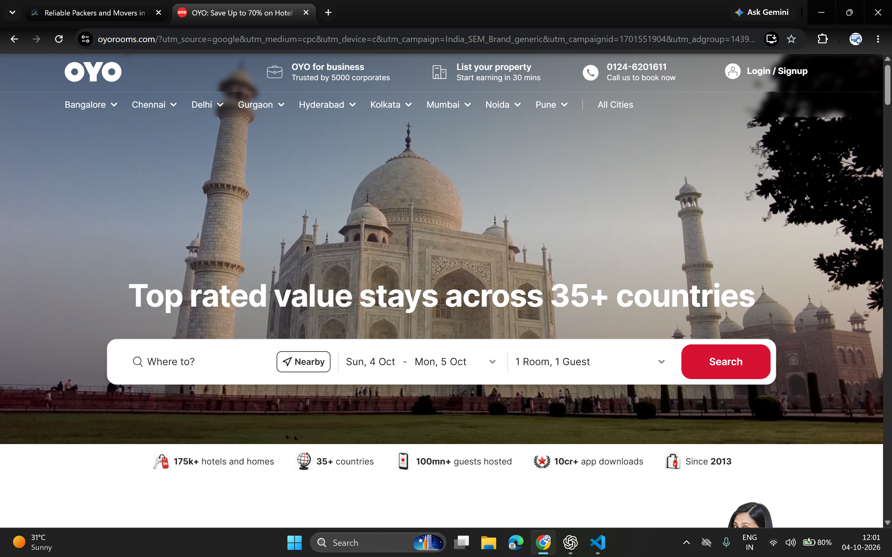
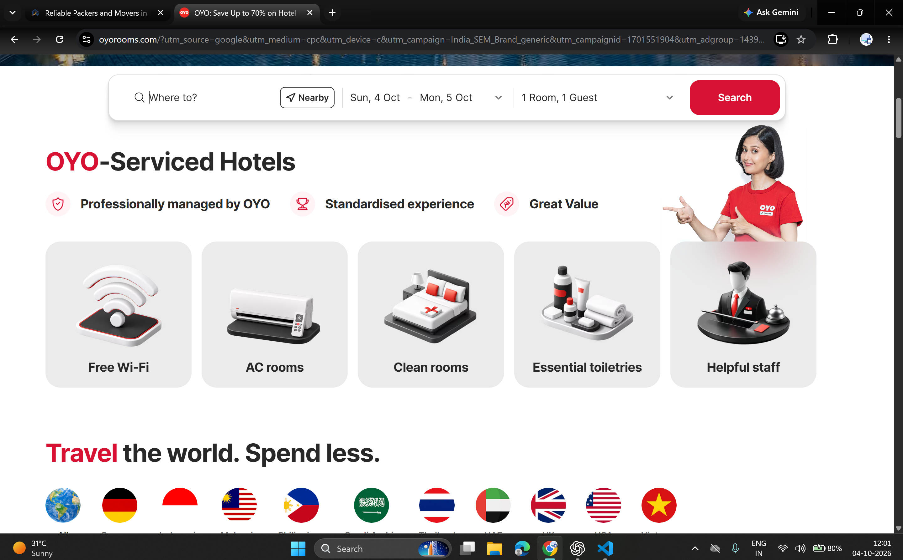
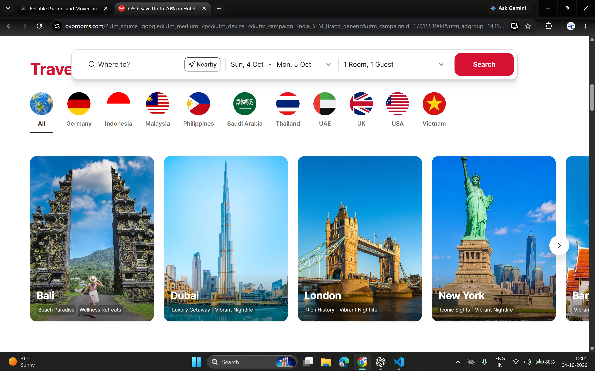
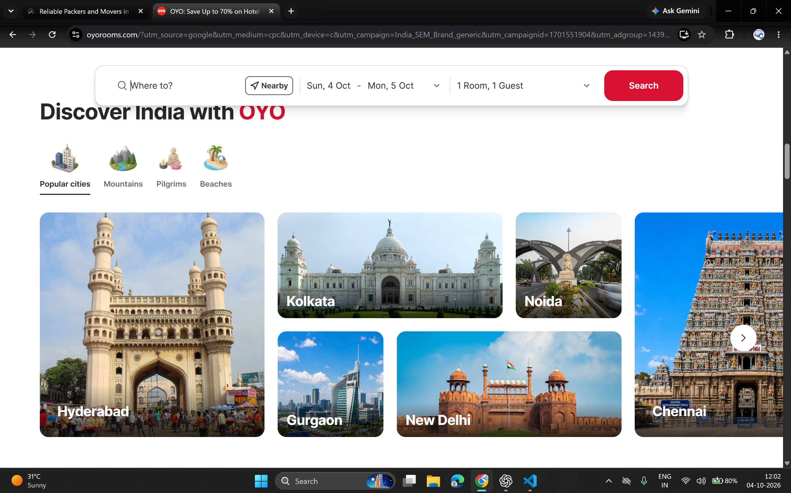
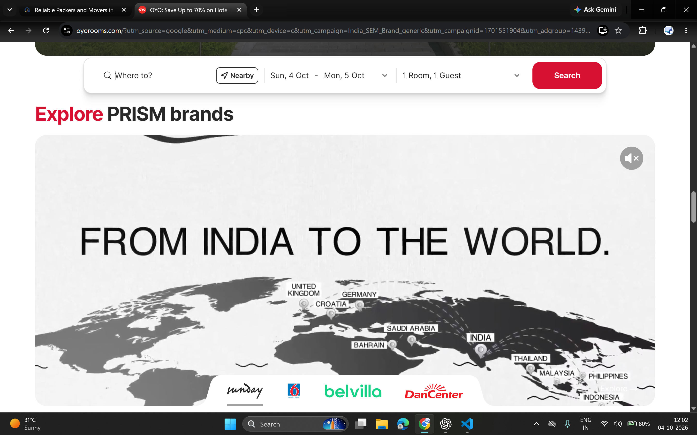
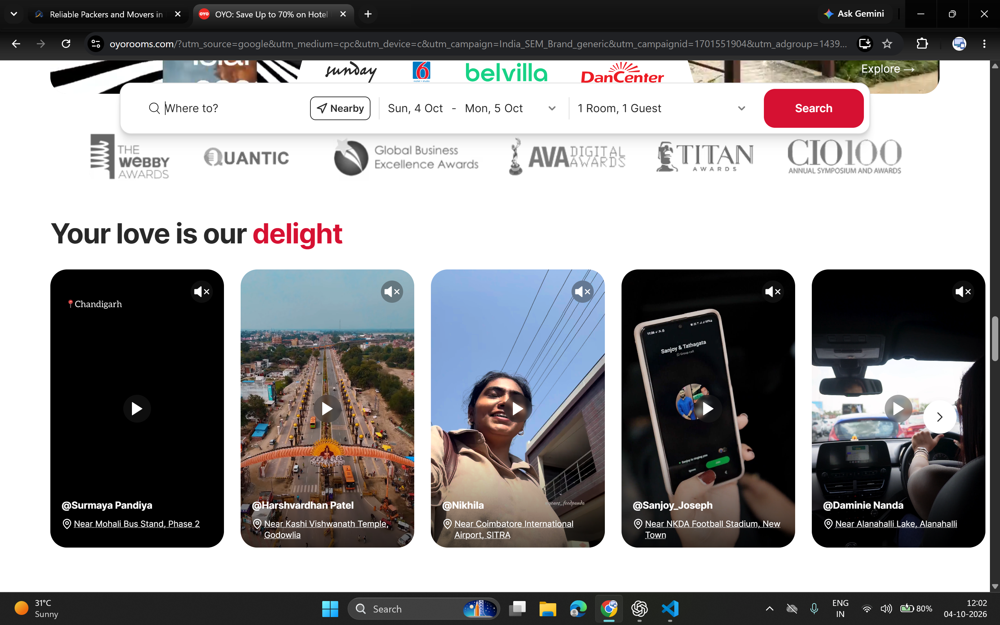
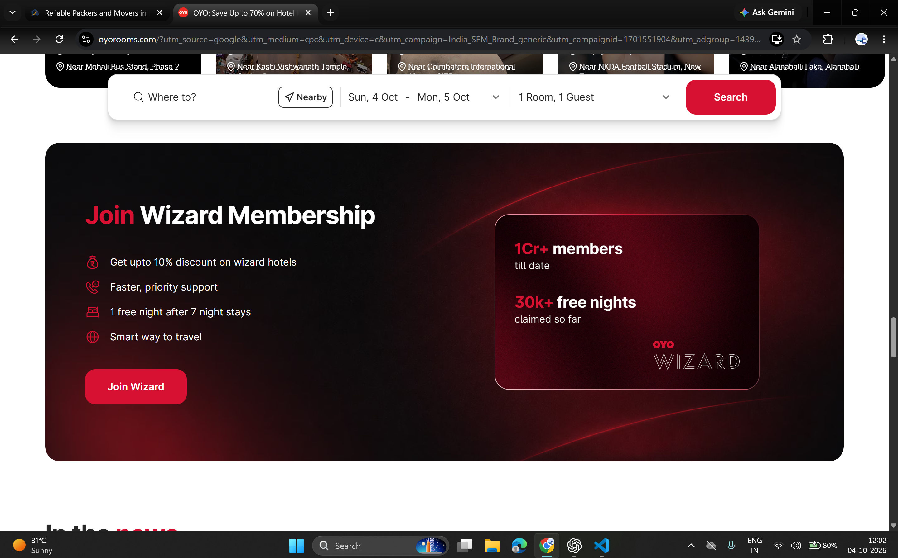
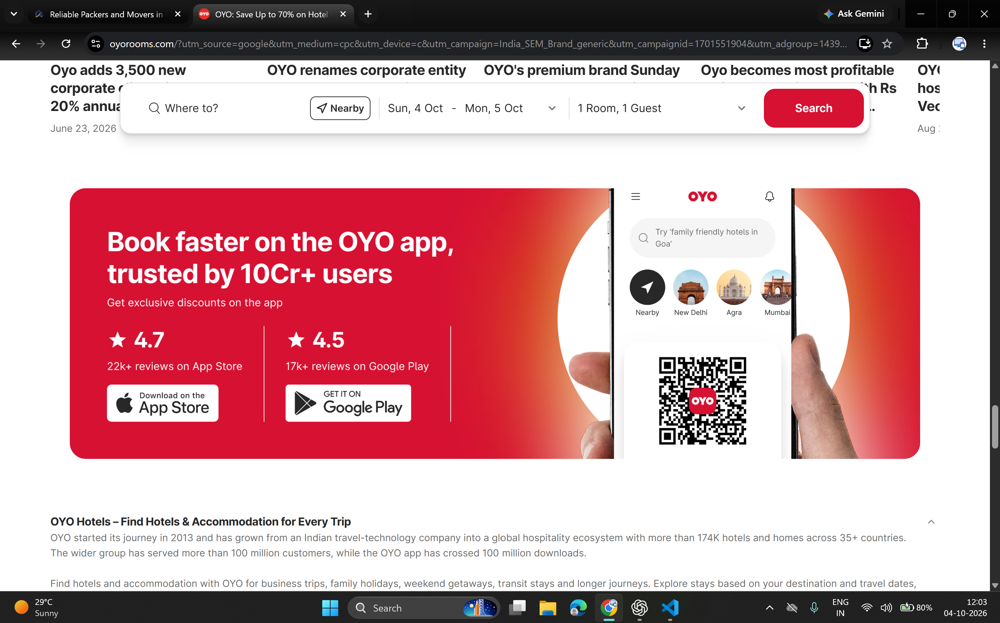
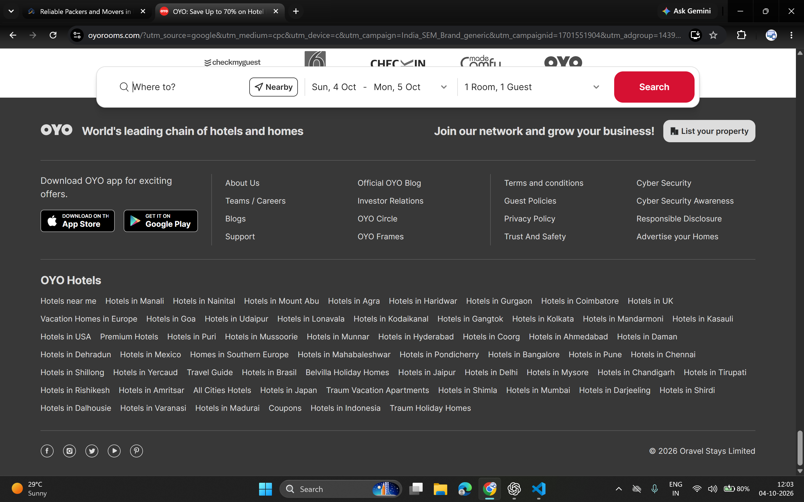

> Responsive homepage update: hero and enquiry now share a natural layout without negative margins or a persistent sticky form. Mobile service/location cards use two columns; process steps use compact image/text rows. Header uses 44px controls and a light 4px blur. Footer is warm charcoal with the retained marquee, reverse logo and lighter links. FAQ controls use a right-aligned plus/minus.

> Hero/modal refinement: the hero fills the desktop viewport and extends behind the floating route bar on all breakpoints. The native modal keeps background elements inert; opening it locks document scrolling and pauses Lenis, while closing restores the prior scroll settings.

> Enquiry refinement: contact inputs include example placeholders; all service and detail selectors use the shared CustomSelect. Known origin/destination cities suggest city, same-state, or interstate move type; unrecognized custom locations require manual selection. Location suggestions prioritize exact and prefix city matches, show city/state on separate lines, and omit repeated branch badges.

> Current update: the homepage now uses a two-step route-bar enquiry. Step one captures route and service; step two opens an accessible modal for contact and moving details. One final POST sends the complete enquiry. The separate homepage form is removed; dedicated quote and other page forms remain. Move size is saved in the lead notes and notification without a database migration. Header blur is reduced to 8px, and the header scrolls away. Earlier descriptions of query-prefill into a second homepage form are superseded.

# OYO reference study for Om Rudra

Updated: 4 October 2026. Source: nine screenshots supplied by the user. This document studies those captures; it does not assert that OYO's current live website is identical.

## Client direction

Use a red theme and learn from OYO's visual hierarchy and enquiry flow. Keep the full enquiry form in the first or second section. Preserve the footer marquee. The user will replace site images later. Screenshot assets below are internal design references, not production images.

## What the screenshots show

- An image-led opening with a short, bold headline and a prominent white search bar.
- A single action red on a mainly white canvas, with near-black headings and quiet grey separators.
- A persistent desktop search action while users browse lower sections.
- Recognizable benefit icons and short labels instead of long feature paragraphs.
- Destination filters and large photographs with labels placed over readable gradients.
- A change of visual pace through a contained promotional feature, surrounded by white space.
- Customer videos, awards, membership, apps and brand portfolios where those offerings exist.
- A footer organized by information type with restrained dividers and clear link groups.

These are observed design patterns, not measured conversion results. The screenshots contain no analytics or experiment evidence.

## Adaptation for a moving business

### Opening and enquiry

The homepage header overlays the hero with a light white tint, backdrop blur, white navigation and the reverse logo. It scrolls away with the page. Opening the mobile menu uses a readable white surface. Inner pages use a solid header in normal document flow. The desktop route bar sticks at the viewport top after the header scrolls away, avoiding stacked bars.

Use a moving photograph, not a tourism landmark, for the hero. Lead with the person's next address and the move they need to plan. The route bar asks for pickup, destination and service. Its action is **Plan my move**, not Search or Book now, because Om Rudra quotes and confirms moves manually.

The route bar passes the chosen values to the existing full form; it must not send a fabricated lead, assume a moving date or promise a price. Keep the full form in section two. Keep Call and WhatsApp available on mobile. Desktop stickiness must respect the header and leave the form heading visible after navigation.

### Services and locations

Use simple image cards with a service title, one helpful sentence and a clear quote link. Filters use visible labels and underline the active choice. Region cards show moving destinations, with city links resolved through the existing location data. Do not copy international hotel destinations or imply a physical branch at every listed city.

### Decision support

Adapt the contained membership-style feature into a moving consultation block using real contact information. Answer practical questions about inventory, access, quote scope and insurance. Testimonials, reviews, awards, discounts and fleet counts stay absent until the client supplies evidence. No membership, app download or brand portfolio is added for visual resemblance.

### Footer

Keep the marquee. Use a white-to-soft-rose transition, dark readable text and red accents. Retain contact, service, route and legal navigation. Do not return to a full-width saturated red footer merely because the reference has a dark one.

## Current design tokens

Source of truth: `frontend/website/src/index.css`.

- Background: `#FFFFFF`.
- Neutral surface: `#F6F6F7`.
- Brand red: `#B51B35`.
- Action red: `#D7193F`, with white foreground.
- Soft brand surface: `#FFF1F3`.
- Hero overlay: `#211419`.
- Text: `#141416`; secondary text: `#5B5F6B`.
- Border: `#E5E5E7`.
- Display type: Sora; body and form type: Inter.
- Prefer modest card rounding, clear spacing and quiet borders; reserve shadows for the floating route bar and enquiry card.

## Component map

- `Hero.jsx`: moving photograph, centered opening statement, mobile actions.
- `RouteEnquiryBar.jsx`: route and service input, desktop sticky placement, query prefill.
- `QuoteForm.jsx`: existing lead flow, section-two placement, safe estimate wording.
- `TrustBar.jsx`: practical moving support without unverified statistics.
- `ServicesGrid.jsx`: service filters and simpler photo cards.
- `HowItWorks.jsx`: sequential process and existing route-line animation.
- `LocationsSnapshot.jsx`: region filters, photo destination cards and interstate links.
- `MovingHelp.jsx`: consultation feature and accessible native FAQ disclosure controls.
- `Footer.jsx`: retained marquee, soft transition and organized contact/navigation.

## Image replacement brief

Keep existing image URLs until replacements arrive. Prioritize a wide moving-team hero with useful crop space, matching 4:3 service photographs, consistent regional images and authentic packing/delivery process photographs. Check every asset's right to use, alt text, mobile crop and compression. Do not use the archived OYO images on the public website.

## Verification and future checks

Check 390px and 1440px layouts, route validation, swapped locations, query prefill, all service filters, all region filters, FAQ keyboard interaction, sticky offsets and the footer marquee. Route planning creates no external lead; only the full form submits. Successful live lead delivery remains a separate end-to-end check. Existing repository lint debt should be tracked separately from new components.

## Archived screenshots

### 01-hero-route-search

### 02-benefits-service-tiles

### 03-destination-tabs

### 04-city-gallery

### 05-brand-feature

### 06-customer-stories

### 07-membership-feature

### 08-app-promotion

### 09-footer

